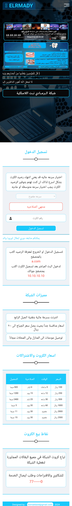

# مرحبًا، أنا مريت أسيد 👋

أنا مهندس برمجيات متخصص في تطوير الويب والتطبيقات المتنقلة. أحب العمل على المشاريع مفتوحة المصدر والمساهمة في مجتمع المطورين.

## لغات البرمجة والأدوات:
- JavaScript
- Python
- React
- Node.js
- Docker

## المشاريع المميزة:
- [مشروعي الأول](https://github.com/MritAsid/project1): وصف قصير للمشروع.
- [مشروعي الثاني](https://github.com/MritAsid/project2): وصف قصير للمشروع.

## كيفية الاتصال بي:
- [LinkedIn](https://www.linkedin.com/in/esmael-asid-a675b5356?utm_source=share&utm_campaign=share_via&utm_content=profile&utm_medium=android_app‏)
- [Twitter](https://twitter.com/username)
- [موقعي الشخصي](https://www.username.com)

## wi fi login interface

#### لمشاهدة الصفحة اضغط على الربط
[زيارة](https://mritasid.github.io/Html_And_Css_template_tow/)

